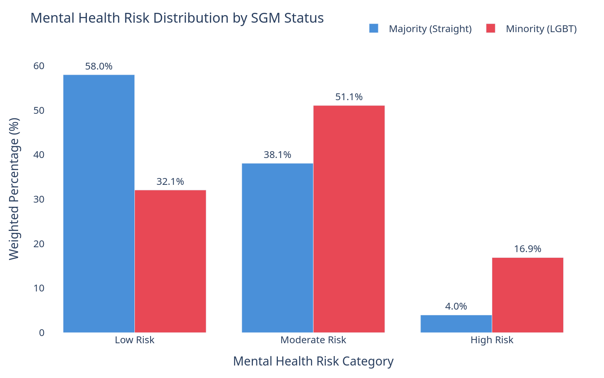

# YRBS Sexual Minority Youth Analysis

Statistical analysis of health disparities among sexual minority youth using 2023 CDC YRBSS data (20K+ respondents). Investigates differences in bullying, substance use, mental health, and victimization between sexual minority and majority adolescents, culminating in predictive models for mental health risk stratification.

**[View Interactive Analysis →](https://anupamasharma2000.github.io/yrbs_sexual_minority_analysis/)**

---

## Key Results

| Metric | SGM Youth | Majority Youth | Ratio |
|--------|-----------|----------------|-------|
| High Mental Health Risk | 16.9% | 4.0% | 4.3× |
| Bullying Prevalence | 73.4% | 71.3% | 1.03× |
| Tobacco Use (any) | 18.8% | 6.0% | 3.1× |



---

## Research Questions

- Are LGBT students bullied more frequently than their heterosexual peers?
- Are sexual minority youth more prone to substance abuse, including illicit drugs and prescription opioids?
- How does sexual identity associate with mental health outcomes such as suicidal ideation, suicide attempts, and feelings of hopelessness?
- What role do experiences such as bullying, parental abuse, and discrimination play in shaping these health behaviors and outcomes?
- Can predictive models identify key factors mediating these disparities?

---

## Dataset

- **Source:** [2023 Youth Risk Behavior Surveillance System (YRBSS)](https://www.cdc.gov/yrbs/)
- **Population:** U.S. adolescents (ages ~13–17) in grades 9–12
- **Sample Size:** 20,103 usable questionnaires after data editing
- **Variables:** 107 survey questions covering demographics, health risk behaviors, mental health, bullying, substance use, sexual activity, and victimization
- **Notable:** First inclusion of transgender identity data in the survey

---

## Methodology

### Data Preparation
- Feature engineering: composite sexual/gender minority flag from sexual identity (q64) and sex of sexual contacts (q2 × q63)
- Column renaming and labeling from YRBS codebook for interpretability
- Ordinal binning for consistency across categorical variables
- Weighted analysis using CDC-provided survey weights (adjusted for nonresponse, oversampling)

### Missing Data Analysis
- Classified missingness as MCAR, MAR, or MNAR
- Weighted missing-rate comparisons across subgroups (LGBT status, sex, race, grade)
- Multiple imputation (8 imputations) using iterative imputer with domain-aware pruning
- Post-imputation distributional checks by race and sexual minority status

### Dimensionality Reduction
- Hypothesis-driven filtering: 107 → ~85 features
- Redundancy removal via Cramér's V (threshold > 0.7): 85 → 81 features
- Model-based feature importance (LightGBM) for final predictor selection

### Predictive Modeling
- **Target:** 3-class mental health risk (Low 73%, Moderate 16%, High 11%)
- **Dataset:** 16,082 youth (80/20 stratified split)
- **Models:**
  - LightGBM with survey weights, class weights, and hyperparameter tuning (GridSearchCV)
  - Multinomial Elastic Net logistic regression
- **Evaluation:** Balanced accuracy, macro F1, high-risk recall, confusion matrices
- **Interpretability:** SHAP values for feature importance across LGBT vs. majority subgroups
- **Robustness:** Results pooled across multiple imputations

### Mental Health Composite
- PCA-derived risk score combining suicidal ideation, planning, attempts, sadness, and treatment needs
- Clinically-weighted severity adjustments mapped to Low / Moderate / High risk categories

---

## Key Findings

- Sexual minority youth report higher rates of bullying, substance use, and mental health challenges compared to heterosexual peers
- SGM youth are 4.3× more likely to fall into the high mental health risk category
- Experiences of discrimination and victimization mediate the higher risk for suicidal ideation and attempts among LGBT youth
- Parental and social factors (family dysfunction, unstable housing) exacerbate these disparities
- LightGBM with SHAP reveals distinct risk factor profiles for LGBT vs. majority youth

---

## Project Structure

```
├── data/
│   ├── raw/
│   │   └── XXHq.csv                      ← Original YRBSS 2023 survey responses
│   └── processed/
│       └── .gitkeep
├── docs/                                  ← GitHub Pages site
│   ├── index.html                         ← Interactive analysis dashboard
│   └── plots/                             ← Plotly JSON data + PNG fallbacks
├── yrbs_analysis_clean.ipynb              ← Full analysis notebook (data → EDA → modeling)
├── LICENSE
└── README.md
```

---

## Dependencies

```
pandas, numpy, matplotlib, seaborn, plotly
scikit-learn, lightgbm, shap
tqdm
```

---

## Contact

Anupama Sharma — [sharma25@umd.edu](mailto:sharma25@umd.edu) · [LinkedIn](https://linkedin.com/in/anupama-sharma22)
